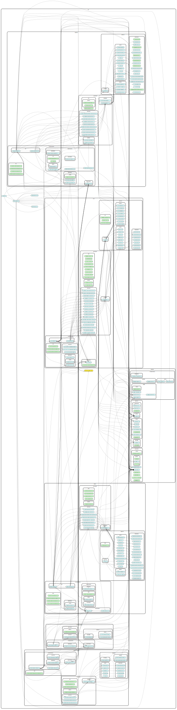
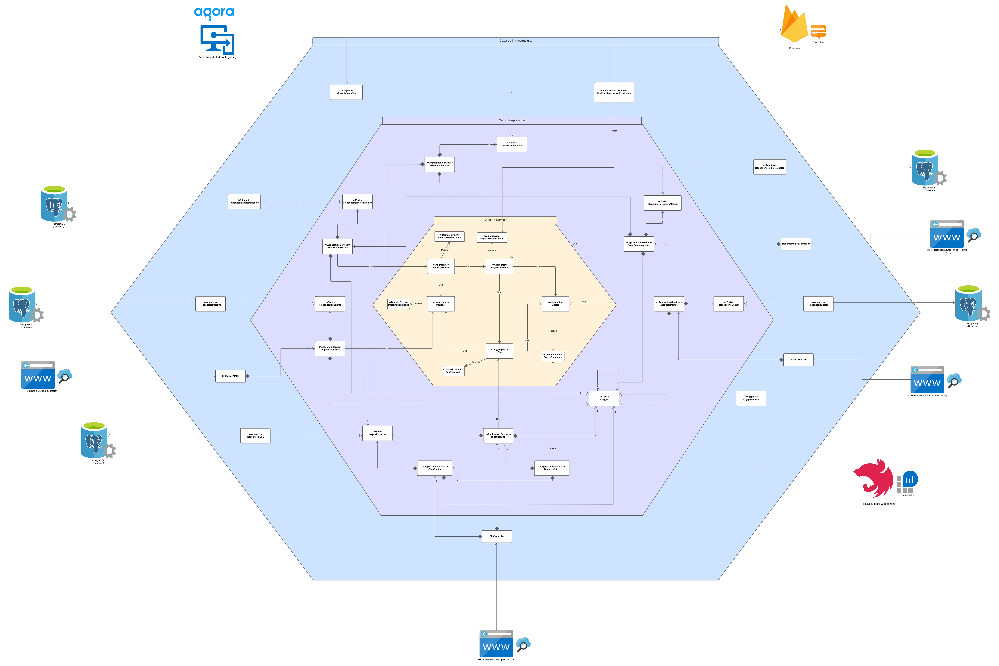

<p align='center'>
    
</p>

# MyOnlineDoctor API
[](https://nestjs.com/) [](https://firebase.google.com/) [](https://www.agora.io/en/)

MyOnlineDoctor API es un servicio de backend desarrollado mediante el uso de la Arquitectura Hexagonal, Domain Driven Design y desarrollado bajo el framework NestJs. Este servicio fue desarrollado para que fuera consumido por las aplicacion web **[MyOnlineDoctorWeb](https://github.com/Code-Rebels-UCAB/MyOnlineDoctorWeb)** y por la aplicacion movil **[MyOnlineDoctorMovil](https://github.com/Code-Rebels-UCAB/MyOnlineDoctorMovil)**

## ℹ️ Pre-requisitos

- [NodeJs](https://nodejs.org/es/download/)
- [TypeScript](https://www.npmjs.com/package/typescript)
- [NestJs](https://docs.nestjs.com/)

### ⚙️ Instalación - MyOnlineDoctorApi

Clonar repositorio:

```
$ git clone https://github.com/Code-Rebels-UCAB/MyOnlineDoctorApi.git
```

### ⏯️ Ejecución de la App

1. Asegurar que todas las dependencias necesarias estén instaladas:

```
$ npm install
```

2. Una vez instalada las dependencias necesarias, basta colocar el siguiente comando para ejecutar la app:

```
$ npm run start
```

## Diagramas
### 🖼️ Diagrama de dependencias



### 🧮 Diagrama de dominio


### 🗺️ Diagrama de Arquitectura hexagonal


<p></p>

## Integrantes y Commits

| Integrantes | Commits mas importantes | Pull Request |
| ------------| ------------------------| ------------ |
| Carlos Arriaga | <p>1.- Caso de uso Solicitar Cita.</p><p>2.- Caso de uso Buscar Doctor Especialidad.</p><p>3.- Caso de uso Aceptar Cita.</p>| <p>1.- https://github.com/Code-Rebels-UCAB/MyOnlineDoctorApi/pull/38</p><p>2.- https://github.com/Code-Rebels-UCAB/MyOnlineDoctorApi/pull/32</p><p>3.- https://github.com/Code-Rebels-UCAB/MyOnlineDoctorApi/pull/40</p>|
| Carlos Landaeta | <p>1.- Caso de Uso Cantidad de Pacientes del Doctor, Caso de Uso Cantidad de Pacientes en el Sistema y Caso de Uso de Cantidad de Citas del Dia Del Doctor.</p></p>| <p>1.- https://github.com/Code-Rebels-UCAB/MyOnlineDoctorApi/pull/35</p>|
| Christian Sanchez | <p>1.- Caso de uso calificar doctor.</p><p>2.- Creación del Servicio Logger.</p><p>3.- Caso de uso Cancelar Cita.</p>| <p>1.- https://github.com/Code-Rebels-UCAB/MyOnlineDoctorApi/pull/37</p><p>2.- https://github.com/Code-Rebels-UCAB/MyOnlineDoctorApi/pull/24</p><p>3.- https://github.com/Code-Rebels-UCAB/MyOnlineDoctorApi/pull/41</p>|
| Franco Gavidia | <p>1.- Creación del Servicio guardar el token Firebase y el Servicio de busqueda Top Doctores.</p><p>2.- Creación del Servicio de Notificar Paciente Llamada.</p><p>3.- Creación del Servicio de Cita Suspendida y Bloqueada.</p>| <p>1.- https://github.com/Code-Rebels-UCAB/MyOnlineDoctorApi/pull/42</p><p>2.- https://github.com/Code-Rebels-UCAB/MyOnlineDoctorApi/pull/49</p><p>3.- https://github.com/Code-Rebels-UCAB/MyOnlineDoctorApi/pull/45</p>|
| Iliana Dias | <p>1.- Creación del Servicio Generar Token Cita.</p><p>2.- Creación del Servicio Iniciar Cita y Finalizar Cita.</p>| <p>1.- https://github.com/Code-Rebels-UCAB/MyOnlineDoctorApi/pull/42</p><p>2.- https://github.com/Code-Rebels-UCAB/MyOnlineDoctorApi/pull/47</p>|
| Jose Flores | <p>1.- Caso de uso Citas al Dia del Doctor. </p><p>2.- Caso de uso Agendar Cita.</p><p>3.- Creación del Manejador de eventos.</p>| <p>1.- https://github.com/Code-Rebels-UCAB/MyOnlineDoctorApi/pull/46</p><p>2.- https://github.com/Code-Rebels-UCAB/MyOnlineDoctorApi/pull/36</p><p>3.- https://github.com/Code-Rebels-UCAB/MyOnlineDoctorApi/pull/44</p>|

### 🔥 [Code Rebels](https://github.com/Code-Rebels-UCAB)

- **Carlos Landaeta - [calejandrolg99](https://github.com/calejandrolg99)**
- **Franco Gavidia - [SARKOT07](https://github.com/SARKOT07)**
- **Iliana Dias - [ilixna](https://github.com/ilixna)**
- **Tadeo Vazquez - [Teidue](https://github.com/Teidue)**
- **Christian Sanchez - [ChristianSanchez25](https://github.com/ChristianSanchez25)**
- **Jose Flores - [Joshep27](https://github.com/Joshep27)**
- **Alines Ortiz - [aliortiz2000](https://github.com/aliortiz2000)**
- **Carlos Arriaga - [carlosead1410](https://github.com/carlosead1410)**
